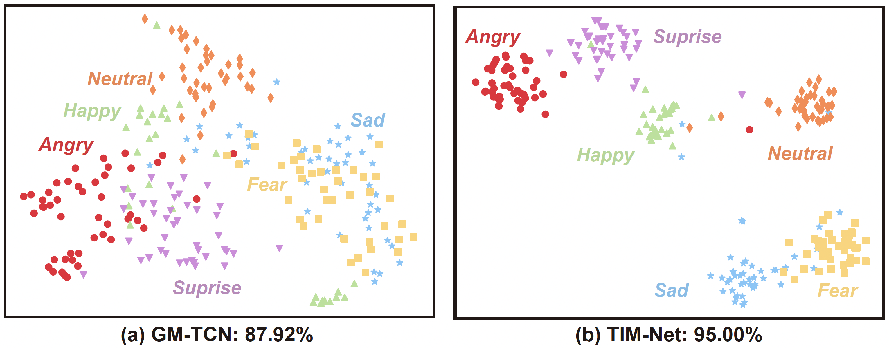

# TIM-Net for SER

## Introduction

These are the supplementary material and Tensorflow 2.7 implementation of our paper "**Temporal Modeling Matters: A Novel Temporal Emotional Modeling Approach for Speech Emotion Recognition**", `under review` in ICASSP 2023.

In this paper, we propose a **T**emporal-aware b**I**-direction **M**ulti-scale Network, termed **TIM-Net**, which is a novel temporal emotional modeling approach to learn multi-scale contextual affective representations from various time scales. 

Extensive experimental results on six benchmark SER datasets (CASIA, EMODB, EMOVO, IEMOCAP, RAVDESS, and SAVEE) demonstrate the superior performance of TIM-Net, gaining 2.34% and 2.61% improvements of the average UAR and WAR over the second-best on each corpus. Remarkably, TIM-Net outperforms the latest domain-adaptation method on the cross-corpus SER tasks, demonstrating strong generalizability.

*We will update our codes and pre-processing features (MFCC) very soon.*


## Folder structure

```
TIM-NEt_SER
├─ Code (Update very soon)
│    ├─ BiDTCNs.py
│    ├─ Common_Model.py
│    ├─ TCN_Model.py
│    ├─ Utils.py
│    ├─ main.py
│    ├─ requirement.txt
├─ README.md
├─ Supplementary Appendix.pdf
```


## Run

### 1. Clone Repository

```bash
$ git clone https://github.com/Jiaxin-Ye/TIM-Net_SER.git
$ cd TIM-Net_SER/Code
```

## 2. Requirements

Our code is based on Python 3 (>= 3.8). There are a few dependencies to run the code. The major libraries are listed as follows:

* Tensorflow-gpu (>= 2.5.0)
* Keras (>= 2.5.0, the same as TF)
* Scikit-learn (== 1.0.2)
* NumPy (>= 1.19.5)
* SciPy (== 1.8.0)
* librosa (== 0.8.1)
* Pandas (== 1.4.1)
* ......

```bash
$ pip install -r requirement.txt
```

## Datasets

The five public emotion datasets are used in the experiments: the Institute of Automation of Chinese Academy of Sciences (CASIA), Berlin Emotional dataset (EMODB), Italian Emotional Speech dataset (EMOVO), Interactive EMOtional dyadic motion CAPture database (IEMOCAP), Ryerson Audio-Visual Dataset of Emotional Speech and Song (RAVDESS), and Surrey Audio-Visual Expressed Emotion dataset (SAVEE). The languages of IEMOCAP, RAVDESS and SAVEE are English. While the CASIA, EMODB and EMOVO datasets contain Chinese, German and Italian speeches.

| Dataset | Language | Speakers [Male/Female] | Numbers | Emotion [No. : Category List]                                | Frequency |
| ------- | -------- | ---------------------- | ------- | ------------------------------------------------------------ | --------- |
| CASIA   | Chinese  | 2/2                    | 1,200   | 6: Angry, Fear, Happy, Neutral, Sad, Surprise                | 22.1      |
| EMODB   | German   | 5/5                    | 535     | 7: Angry, Boredom, Disgust, Fear, Happy,  Neutral, Sad       | 16.0      |
| EMOVO   | Italian  | 3/3                    | 588     | 7: Angry, Disgust, Fear, Happy,  Neutral, Sad, Surprise      | 48.0      |
| IEMOCAP | English  | 5/5                    | 5,531   | 4: Angry, Happy, Neutral, Sad                                | 48.0      |
| RAVDESS | English  | 12/12                  | 1,440   | 8: Angry, Calm, Disgust, Fear, Happy, Neutral, Sad, Surprise | 48.0      |
| SAVEE   | English  | 4/0                    | 480     | 7: Angry, Disgust, Fear, Happy,  Neutral, Sad, Surprise      | 44.1      |

***If you don't have convenient access to these datasets, you can download it from our shared `links`: https://pan.baidu.com/s/1K71RAaFSPPDUPoVX90_-JA?pwd=DATA `code`: DATA.***

## Preprocessing

In the experiments, the 39-D MFCCs are extracted from the Librosa toolbox with the default settings. That is, the frame length is 0.05 s, the frame shift is 0.0125 s, the sample rate is 22050 kHz and the window function added for the speech is Hamming window. For the cross-corpus SER task, the "mean_signal_length" is set to 100000. 

```python
def get_feature(file_path: str, mfcc_len: int = 39, flatten: bool = False):
    signal, fs = librosa.load(file_path)
    s_len = len(signal)

    if s_len < mean_signal_length:
        pad_len = mean_signal_length - s_len
        pad_rem = pad_len % 2
        pad_len //= 2
        signal = np.pad(signal, (pad_len, pad_len + pad_rem), 'constant', constant_values = 0)
    else:
        pad_len = s_len - mean_signal_length
        pad_len //= 2
        signal = signal[pad_len:pad_len + mean_signal_length]
    mfcc = librosa.feature.mfcc(y=signal, sr=fs, n_mfcc=39)
    mfcc = mfcc.T
    feature = mfcc
    return feature
```

## Training and Testing

### Training

```bash
$ python main.py --mode train --data EMODB --split_fold 10 --random_seed 46 --epoch 200 --gpu 0
```

### Testing

If you want to test your model on 10-fold cross-validation manner with `46' random seed, you can run following command with:

```bash
$ python main.py --mode test --data EMODB  --test_path ./Best_Models/EMODB_46 --split_fold 10 --random_seed 46
```

## SER Results


The overall results of different SOTA methods on six SER benchmark corpora under 10-fold CV. Evaluation measures are UAR(%) / WAR(%). The `-' implies the lack of this measure, and the best results are highlighted in **bold**.

| Model       |   Year   |       CASIA       | Model        |   Year   |       EMODB       | Model       |   Year   |       EMOVO       |
| :---------- | :------: | :---------------: | :----------- | :------: | :---------------: | :---------- | :------: | :---------------: |
| DT-SVM      |   2019   |   85.08 / 85.08   | TSP+INCA     |   2021   |   89.47 / 90.09   | RM+CNN      |   2021   |   68.93 / 68.93   |
| TLFMRF      |   2020   |   85.83 / 85.83   | GM-TCN       |   2022   |   90.48 / 91.39   | SVM         |   2021   |   73.30 / 73.30   |
| GM-TCN      |   2022   |   90.17 / 90.17   | Light-SERNet |   2022   |   94.15 / 94.21   | TSP+INCA    |   2021   |   79.08 / 79.08   |
| CPAC        |   2022   |   92.75 / 92.75   | CPAC         |   2022   |   94.22 / 94.95   | CPAC        |   2022   |   85.40 / 85.40   |
| **TIM-Net** | **2023** | **94.67 / 94.67** | **TIM-Net**  | **2023** | **95.17 / 95.70** | **TIM-Net** | **2023** | **92.00 / 92.00** |

| **Model**    | **Year** |    **IEMOCAP**    | **Model**   | **Year** |    **RAVDESS**    | **Model**   | **Year** |     **SAVEE**     |
| :----------- | :------: | :---------------: | :---------- | :------: | :---------------: | :---------- | :------: | :---------------: |
| MHA+DRN      |   2019   |     67.40 / -     | INCA+TS-CNN |   2021   |     - / 85.00     | 3D CNN      |   2019   |     - / 81.05     |
| CNN+Bi-GRU   |   2020   |   71.72 / 70.39   | TSP+INCA    |   2021   |   87.43 / 87.43   | TSP+INCA    |   2021   |   83.38 / 84.79   |
| SPU+MSCNN    |   2021   |   68.40 / 66.60   | GM-TCN      |   2022   |   87.64 / 87.35   | GM-TCN      |   2022   |   86.02 / 83.88   |
| Light-SERNet |   2022   |   70.76 / 70.23   | CPAC        |   2022   |   88.41 / 89.03   | CPAC        |   2022   |   83.69 / 85.63   |
| **TIM-Net**  | **2023** | **72.50 / 71.65** | **TIM-Net** | **2023** | **91.93 / 92.08** | **TIM-Net** | **2023** | **86.31 / 87.71** |

## Visualization of Learned Affective Representation

The results confirm that the TIM-Net provides more class-discriminative representations to support superior performance.




## Domain Generalization Analysis

Due to various languages and speakers, the SER corpora, although sharing the same emotion, have considerably significant domain shifts. The generalization of the model to unseen domain/corpus is critically important for SER. We likewise validate the generalizability of TIM-Net on the cross-corpus SER task. 

Surprisingly, TIM-Net outperforms CAAM [1], one latest task-specific domain-adaptation method. The results suggest that our TIM-Net is effective in modeling emotion with strong generalizability.


| Method                                       |        TCN        |       CAAM        |       TIM-Net        |
| -------------------------------------------- | :---------------: | :---------------: | :------------------: |
| $\mathrm{UAR}_\mathrm{avg} \pm \mathrm{std}$ | 24.47 $\pm$ 0.38  | 32.37 $\pm$ 0.27  | **34.49 $\pm$ 0.43** |
| $\mathrm{WAR}_\mathrm{avg} \pm \mathrm{std}$ | 24.39 $\pm$ 0.42. | 33.65 $\pm$ 0.41. | **35.66 $\pm$ 0.32** |

## Reference
[1] *#XinCheng Wen, #JiaXin Ye, Yan Luo, et al., “CTL-MTNet: A novel capsnet and transfer learning-based mixed task net for single-corpus and cross-corpus speech emotion recognition,” in IJCAI 2022, Vienna, Austria, 23-29 July 2022, 2022, pp.2305–2311*

## Citation

If you compare or use our model in your own work, please cite the following
[paper](https://arxiv.org/abs/2211.08233):

```bibtex
@article{jiaxin2022TIMNET,
  title={Temporal Modeling Matters: A Novel Temporal Emotional Modeling Approach for Speech Emotion Recognition},
  author = {Ye, Jiaxin and Wen, Xincheng and Wei, Yujie and Xu, Yong and Liu, Kunhong and Shan, Hongming},
  journal={arXiv preprint arXiv:2211.08233},
  year={2022}
}
```

