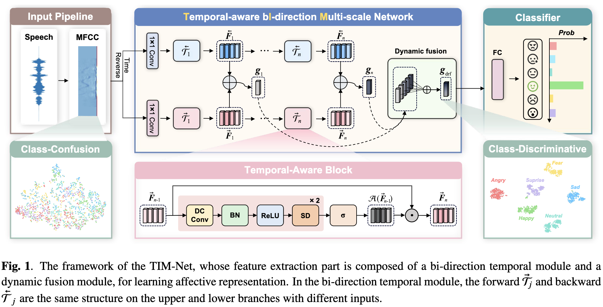
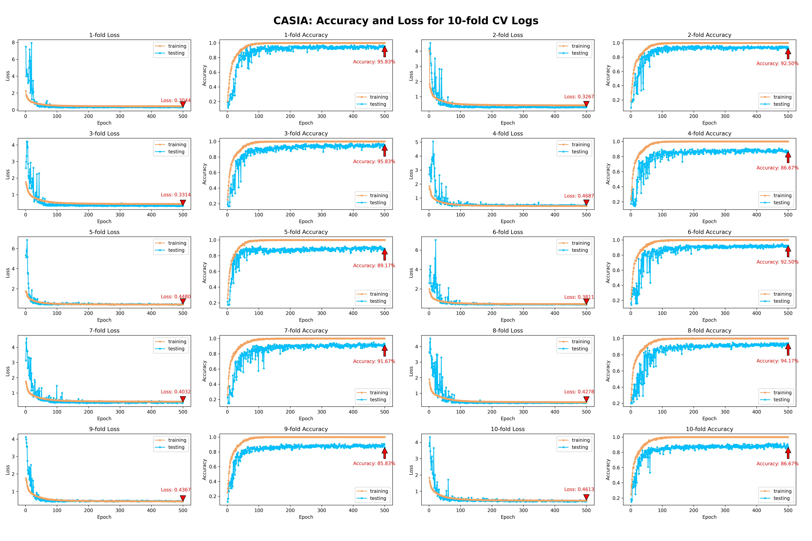
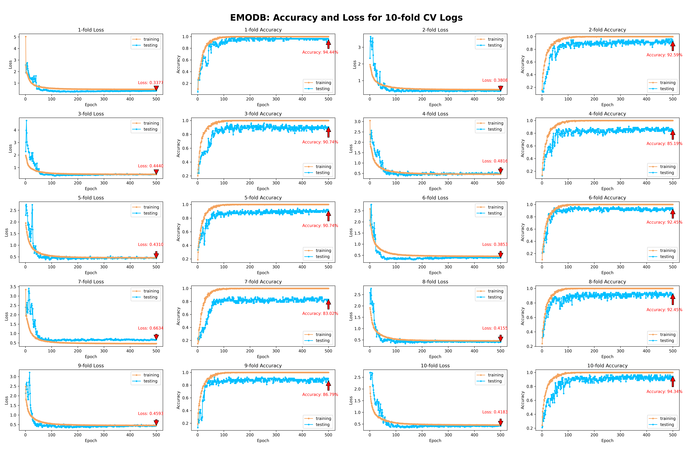
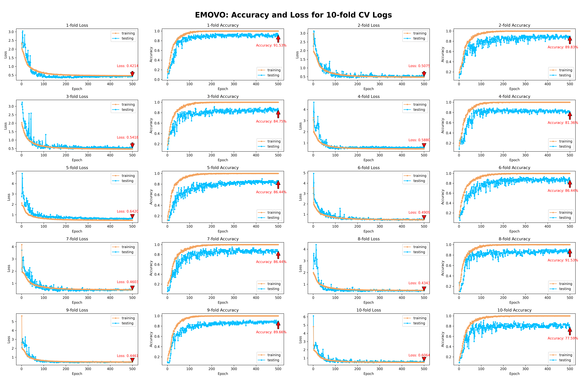
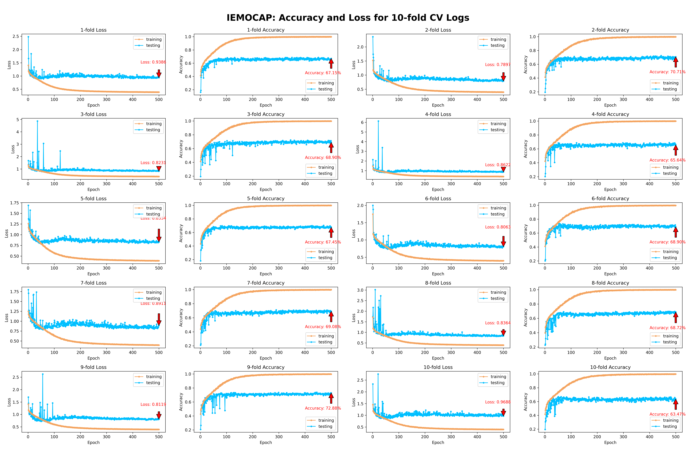
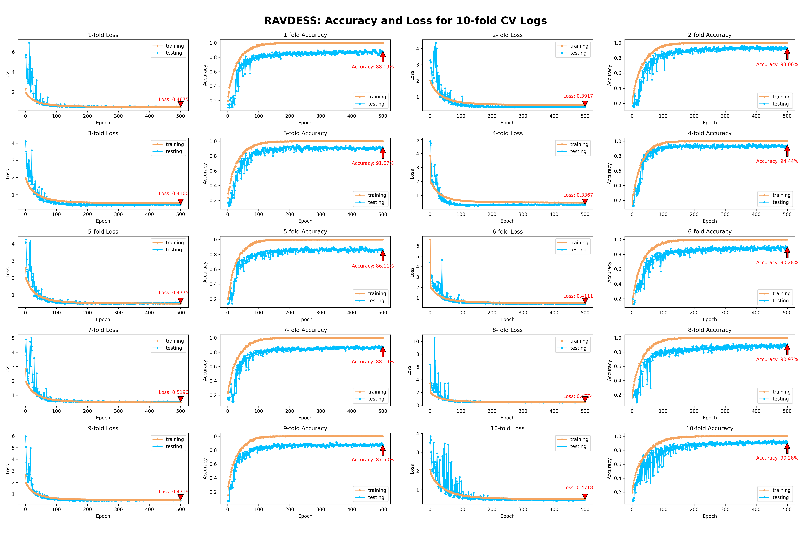
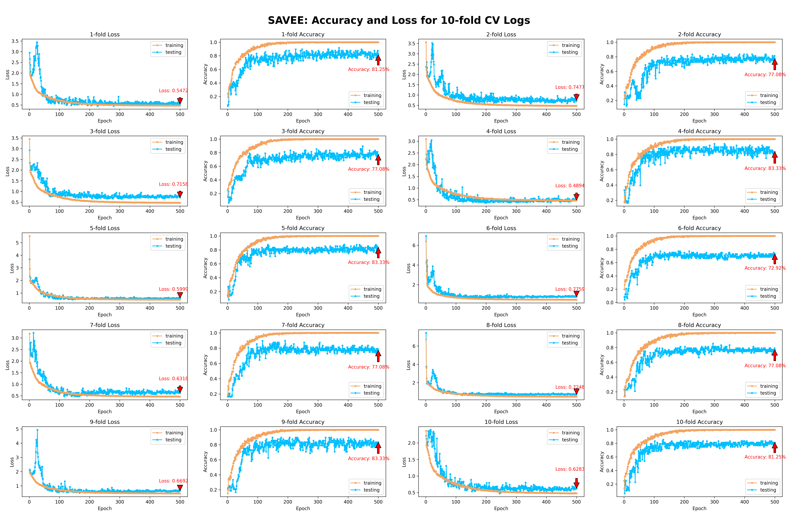

# TIM-Net

Official Tensorflow implementation of ICASSP 2023 paper, "Temporal Modeling Matters: A Novel Temporal Emotional Modeling Approach for Speech Emotion Recognition". [[paper]](https://arxiv.org/abs/2211.08233) [[code]](https://github.com/Jiaxin-Ye/TIM-Net_SER) 

### 📕Introduction

In this paper, we propose a **T**emporal-aware b**I**-direction **M**ulti-scale Network, termed **TIM-Net**, which is a novel temporal emotional modeling approach to learn multi-scale contextual affective representations from various time scales. 



## 📖 Usage:

> **Our MFCC features files (*.npy)**: 
>
> `Baidu links`: https://pan.baidu.com/s/1Y-GDJXpF0FqjcGGN6y84JA?pwd=MFCC `code`: MFCC 
>
> `Google links`: https://drive.google.com/drive/folders/1nl7hej--Nds2m3MrMDHT63fNL-yRRe3d
>
>
> **Our testing model weight files (*.hdf5)**: 
>
> `Baidu links`:  https://pan.baidu.com/s/1EtjhuljeHwvIjYG8hYtMXQ?pwd=HDF5 `code`: HDF5
>
> `Google links`: https://drive.google.com/drive/folders/1ZjgcT6R0A0C2twXatgpimFh1a3IL81pw

### 1. Clone Repository

```bash
$ git clone https://github.com/Jiaxin-Ye/TIM-Net_SER.git
$ cd TIM-Net_SER/Code
```

### 2. Requirements

Our code is based on Python 3 (== 3.8). There are a few dependencies to run the code. The major libraries are listed as follows:

* Tensorflow-gpu (== 2.5.0)
* Keras (== 2.5.0, the same as TF)
* Scikit-learn (== 1.0.2)
* NumPy (== 1.19.5)
* SciPy (== 1.8.0)
* librosa (== 0.8.1)
* Pandas (== 1.4.1)
* ......

```bash
$ pip install -r requirement.txt
```

### 3. Datasets

The six public emotion datasets are used in the experiments: the CASIA, EMODB, EMOVO, IEMOCAP, RAVDESS, and SAVEE. The languages of IEMOCAP, RAVDESS and SAVEE are English, while the CASIA, EMODB and EMOVO datasets contain Chinese, German and Italian speech signals.

### 4. Preprocessing

In the experiments, the 39-D static MFCCs are extracted using the Librosa toolbox with the **default settings**. Specifically, the frame length is 50 ms, the frame shift is 12.5 ms, the sample rate is 22050 Hz and the window function added for the speech is Hamming window. In the single-corpus SER task, the "mean_signal_length" is set to 88000, 96000, 96000, 310000, 110000, 130000 for CASIA, EMODB, EMOVO, IEMOCAP, RAVDESS and SAVEE, which is almost the same as the maximum length of the input sequences. If you are not convenient to preprocess these features, you can download them from our shared [link](https://pan.baidu.com/s/1Y-GDJXpF0FqjcGGN6y84JA?pwd=MFCC ) to `MFCC` folder.

```bash
$ python extract_feature.py --data_name CASIA --mean_signal_length 88000
$ python extract_feature.py --data_name EMODB --mean_signal_length 96000
$ python extract_feature.py --data_name EMOVO --mean_signal_length 96000
$ python extract_feature.py --data_name IEMOCAP --mean_signal_length 310000
$ python extract_feature.py --data_name RAVDE --mean_signal_length 110000
$ python extract_feature.py --data_name SAVEE --mean_signal_length 130000
```

### 5. Training and Testing

#### Training

```bash
$ python main.py --mode train --data RAVDE --split_fold 10 --random_seed 46 --epoch 500 --gpu 0
```

#### Testing

If you want to test your model on 10-fold cross-validation manner with `X' random seed, you can run the following commands:

```bash
$ python main.py --mode test --data CASIA  --test_path ./Test_Models/CASIA_32 --split_fold 10 --random_seed 32
$ python main.py --mode test --data EMODB  --test_path ./Test_Models/EMODB_46 --split_fold 10 --random_seed 46
$ python main.py --mode test --data EMOVO  --test_path ./Test_Models/EMOVO_1 --split_fold 10 --random_seed 1
$ python main.py --mode test --data IEMOCAP  --test_path ./Test_Models/IEMOCAP_16 --split_fold 10 --random_seed 16
$ python main.py --mode test --data RAVDE  --test_path ./Test_Models/RAVDE_46 --split_fold 10 --random_seed 46
$ python main.py --mode test --data SAVEE  --test_path ./Test_Models/SAVEE_44 --split_fold 10 --random_seed 44
```

You can download our model files from our shared [link]( https://pan.baidu.com/s/1EtjhuljeHwvIjYG8hYtMXQ?pwd=HDF5) to `Test_Models` folder. 

### 6. Training Details

#### 6.1 Experiment Settings

The **cross-entropy criterion** is used as the objective function and **overall epoch** is set to 500. Adam algorithm is adopted to optimize the model with an initial **learning rate** $\alpha$ = $0.001$, and a **batch size** of 64. To avoid over-fitting during the training phase, we implement label **smoothing with factor** 0.1 as a form of regularization and set the **spatial dropout rate** to 0.1. For the $j$-th TAB $\mathcal{T}_j$, there are 39 **kernels** of **size** 2 in Conv layers, and the **dilated rate** is $2^{j-1}$. To guarantee that the maximal receptive field covers the input sequences, we set the **number of TAB** $n$ in both directions to 10 for IEMOCAP and 8 for others. Furthermore, we perform **10-fold cross-validation (CV)** as well as previous works in experiments. 

#### 6.2 Model Size

Since not all SOTA methods we compared provide their source codes or model sizes in the paper, we can only select some typical ones for size comparison. For example, the model sizes of *Light-SERNet* (0.88 MB), *GM-TCN* (1.13 MB), and *CPAC* (1.23 MB) are all larger than TIM-Net (**0.40** MB). Our proposed models are trained on an Nvidia GeForce RTX 3090 GPU with an average of 60 ms per step. The results demonstrate that our TIM-Net is **lightweight** yet **effective**.

#### 6.3 Training Procedure

We show the accuracy and loss curves on the whole six corpora in the following figures. The experimental results indicate that TIM-Net does not exhibit significant overfitting issues, and its convergence curves remain relatively stable.













## 🗂️ Folder Structure

```
TIM-NEt_SER
├─ Code
│    ├─ MFCC (Download MFCC files here)
│    ├─ Models (Store model files)
│    ├─ Results (Store result files)
│    ├─ Test_Models (Download pretrained models here)
│    ├─ Model.py
│    ├─ TIMNET.py
│    ├─ Common_Model.py
│    ├─ main.py
│    ├─ extract_feature.py
│    └─ requirement.txt
├─ README.md
```

## 🙌🏻 Acknowledgement

- We thank the [@adrianastan](https://github.com/adrianastan), [@VlaDanilov](https://github.com/VlaDanilov), [@NAM-hj](https://github.com/NAM-hj), [@rageSpin](https://github.com/rageSpin), and other researchers on the GitHub with many valuable and insightful suggestions.
- If you find this project useful for your research, please cite [our paper](https://arxiv.org/abs/2211.08233):

```bibtex
@inproceedings{TIMNET,
  title={Temporal Modeling Matters: A Novel Temporal Emotional Modeling Approach for Speech Emotion Recognition},
  author = {Ye, Jiaxin and Wen, Xincheng and Wei, Yujie and Xu, Yong and Liu, Kunhong and Shan, Hongming},
  booktitle = {ICASSP 2023-2023 IEEE International Conference on Acoustics, Speech and Signal Processing (ICASSP), Rhodes Island, Greece, June 4-10, 2023},
  pages={1--5},
  year = {2023}
}
```

------

## 📊 Additional Experimental Results Update (for CPAC and GM-TCNet)

After carefully rechecking the single-corpus SER code of CPAC [1] and GM-TCNet [2], we identified that there is the same improper utilization of the callback function leading to overfitting issues, which has not been addressed in some open-sourced projects and works. Here, we have updated the corresponding results to avoid overfitting issues. The updated experimental results show that the performance remain competitive.

| UAR (%)/WAR (%) |       CASIA       |       EMODB       |      RAVDESS      |       SAVEE       |
| :-------------: | :---------------: | :---------------: | :---------------: | :---------------: |
|    GM-TCNet     |   85.50 / 85.50   |   86.17 / 85.70   |   82.78 / 82.62   |   75.83 / 73.57   |
|      CPAC       |   88.33 / 88.33   |   86.92 / 86.15   |   81.25 / 80.47   |   75.63 / 73.21   |
|     TIM-Net     | **91.08 / 91.08** | **89.19 / 90.28** | **90.04 / 90.07** | **77.26 / 79.36** |

> [1] [CTL-MTNet](https://www.ijcai.org/proceedings/2022/0320.pdf): A Novel CapsNet and Transfer Learning-Based Mixed Task Net for the Single-Corpus and Cross-Corpus Speech Emotion Recognition, _**IJCAI 2022**_.
>
> [2] [GM-TCNet](https://arxiv.org/abs/2210.15834): Gated Multi-scale Temporal Convolutional Network using Emotion Causality for Speech Emotion Recognition, _**Speech Communication 2022**_.
